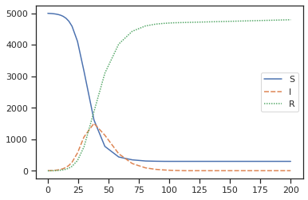

# Pandemic modelling
> Test implementing some models


## Install

```bash
git clone ...pandemic
cd pandemic
pip install .
```

```python
model = SIR(N=5000,I=6, beta=0.3, gamma=0.1, days=100)
model.plot()
```




