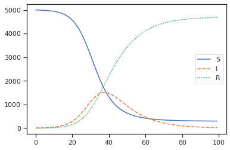

# Pandemic modelling
> Test implementing some models


## Install

```bash
git clone ...pandemic
cd pandemic
pip install .
```

```python
model = SIR(N=5000,I=6, b=0.3, g=0.1)
model.plot(days=200)
```




